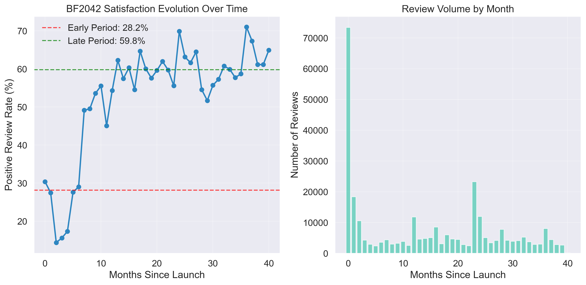
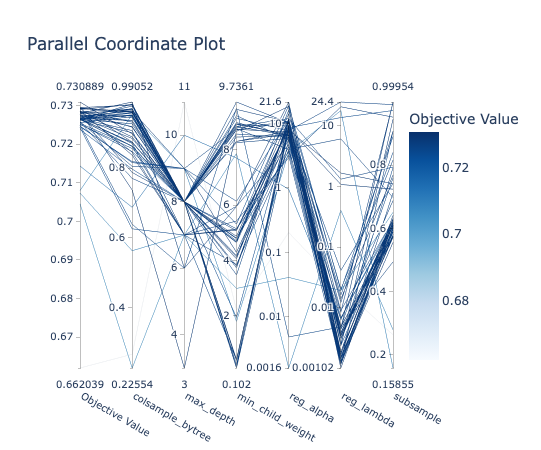

# 🎯 **Battlefield 2042 Review Prediction with XGBoost**

This project demonstrates advanced machine learning capabilities in gaming analytics by building an XGBoost classifier to predict Battlefield 2042 player recommendations. It extends from the [Battlefield 2042 Steam Reviews Analysis](https://github.com/ken1th/SteamReviewAnalysis) project with sophisticated ML modeling, SHAP interpretability, and bias-aware analysis.

## **Main Code: [battlefield2042_xgboost_model.ipynb](battlefield2042_xgboost_model.ipynb)**
---
## 🏆 **Key Results**

| Metric | Value | Business Impact |
|--------|-------|-----------------|
| **Test Set AUC** | 0.77 | Robust generalization to unseen temporal data |
| **Temporal Distribution Shift** | 28.2% → 59.8% positive | Quantifies BF2042's post-launch improvement |
| **Top SHAP Feature** | Days Since Launch | Post-launch strategy effectiveness confirmed |
| **Regional Variance** | Significant | Localization opportunities identified |



## 🔍 **Key Discovery: SHAP Reveals What Actually Drives Player Satisfaction**

**Major Insight**: SHAP analysis reveals that **36.1% of model decisions** are driven by `days_since_launch`, proving that post-launch strategy is the dominant factor in player satisfaction. The model distinguishes actionable business features (temporal patterns, regional differences) from engagement metrics that represent selection bias.

**Business Impact**: This validates that sustained post-launch development investment directly translates to player satisfaction improvements.


---

## 📊 **Project Overview**

### **Technical Skills Demonstrated**
- **XGBoost**: Production-ready gradient boosting with categorical feature support
- **Optuna**: Advanced hyperparameter optimization with TPE sampling and pruning
- **SHAP**: Model interpretability and explainable AI

### **Business Applications**
- **Post-Launch Strategy Validation**: Quantify ROI of game updates and content releases
- **Regional Market Prioritization**: Identify highest-impact localization opportunities  
- **Player Segmentation**: Target experiences based on gaming behavior profiles
- **Real-Time Health Monitoring**: Automated satisfaction tracking framework

---

## 🚀 **Quick Start**

### **Prerequisites**
```bash
pip install pandas numpy scikit-learn xgboost optuna shap matplotlib seaborn
```

### **Data Requirements**
- `data/battlefield2042_reviews_no_text.csv` - Steam review data
- `data/battlefield2042_pricehistory.csv` - Historical pricing data

### **Running the Analysis**
```bash
jupyter notebook battlefield2042_xgboost_model.ipynb
```

---

## 📁 **Project Structure**

```
SteamReview_XGBoost/
├── battlefield2042_xgboost_model.ipynb    # Main analysis notebook
├── data/
│   ├── battlefield2042_reviews_no_text.csv
│   └── battlefield2042_pricehistory.csv
├── feature_importance.csv                 # SHAP feature rankings
├── confusion_matrix.png                   # Model performance visualization
├── model_performance_curves.png           # ROC and PR curves
├── shap_summary.png                       # SHAP feature impact analysis
├── shap_importance.png                    # Feature importance ranking
├── shap_waterfall.png                     # SHAP waterfall plot
├── gaming_lifecycle_transformation.png    # Temporal satisfaction analysis
├── LICENSE                                # MIT License
└── README.md                              # Project documentation
```

---

## 🔬 **Methodology**

### **1. Bias-Aware Feature Engineering**

Features categorized by business utility and bias risk:

- **🟢 Low-Bias**: User demographics (`num_games_owned`), temporal patterns (`days_since_launch`), regional differences (`language_cleaned`)
- **🟡 Medium-Bias**: Price features (temporal mismatch), review update patterns  
- **🔴 High-Bias**: Engagement metrics (`playtime_hours`, `days_since_last_played`) - predictive but not actionable due to selection effects

### **2. Temporal Validation Strategy**

- **Chronological Split**: 80% train (historical) / 20% test (recent)
- **Time Series Cross-Validation**: Prevents data leakage

### **3. Hyperparameter Optimization with Optuna**

- **Bayesian Optimization**: TPE (Tree-structured Parzen Estimator) sampling for efficient search
- **Automated Pruning**: Early stopping of unpromising trials to reduce computation time
- **Multi-objective Search**: Optimizes for AUC while maintaining model interpretability
- **Reproducible Results**: Saved study object (`optuna_study_bf2042.pkl`) for analysis and continuation



---

## 🔍 **Model Interpretability with SHAP**

Based on SHAP feature importance analysis, several critical patterns emerge with clear business actionability. The percentages below reflect each feature’s **share of total model impact** (mean absolute SHAP value normalized to sum to 100%).


#### **📅 POST-LAUNCH STRATEGY** (**36.1%** of Feature Importance)
**`days_since_launch`** dominates with overwhelming importance, confirming that time since launch strongly affects satisfaction. This validates the critical importance of sustained post-launch content and improvements.

#### 🕹️ RECENT ENGAGEMENT (**19.1%**)
**`days_since_last_played`** shows that recent play activity strongly correlates with positive reviews—highly predictive but partially reflects self-selection (satisfied players play more).

#### **🌍 LOCALIZATION PRIORITY** (**12.0%**)
**`language_cleaned`** shows significant regional differences, suggesting prioritization of region-specific content and cultural adaptation as a key growth strategy.

#### 🎮 PLAYER PROFILE DEPTH (**7.1%**)
**`num_games_owned`** suggests that “core gamers” respond differently; targeting these player segments could help tailor offerings.

#### 💰 PRICING CONTEXT (**4.3%**)
**`price_when_reviewed`** shows some correlation with positive reviews, but the temporal mismatch means this is more about "price when satisfied/dissatisfied enough to review" rather than actual purchase price. Use with caution.

---

### ⚠️ **Model Limitations**

- **Selection Bias**: Engagement metrics predict satisfaction but don't represent causation - satisfied players play more, not vice versa
- **Temporal Mismatch**: Price-at-review vs. price-at-purchase creates false pricing correlations
- **Platform Constraint**: Steam-only data may not generalize to console or other PC platforms

**✅ Best Use Cases**: Temporal satisfaction monitoring, regional market analysis, post-launch strategy ROI assessment

---

## 📊 **Model Performance**

### **Classification Metrics**
- **AUC**: 0.77 (strong discriminative power)
- **Accuracy**: High prediction accuracy on temporal test split
- **Precision/Recall**: Balanced performance across both classes


---

## 🚀 **Next Steps & Business Applications**

### **Immediate ROI Opportunities**

1. **Prioritize regional markets** using language-based satisfaction differences for localization investment
2. **Establish automated alerts** for satisfaction threshold breaches requiring intervention

### **Strategic Extensions**  
1. **Cross-Portfolio Analysis**: Apply methodology to EA's entire game catalog for pattern identification
2. **Predictive Content Planning**: Use satisfaction trends to forecast optimal update timing and content types
3. **Multi-Platform Integration**: Expand to console and Origin data for comprehensive player insights

---

## 📋 **Requirements**

### **Python Requirements**
Python 3.8 or higher is required to run this project.
```txt
pandas>=1.3.0
numpy>=1.21.0
scikit-learn>=1.0.0
xgboost>=3.0.2
optuna>=3.0.0
shap>=0.40.0
matplotlib>=3.5.0
seaborn>=0.11.0
scipy>=1.7.0
```

**Extended From**: [Battlefield 2042 Steam Reviews Analysis](./Battlefield%202042%20Steam%20Reviews%20Analysis%20README.md)

---

## ✅ **Bottom Line**

**Business-Ready Gaming Analytics**: This XGBoost model delivers 0.77 AUC performance while revealing that **36.1% of player satisfaction is driven by post-launch strategy timing**. SHAP analysis identifies actionable business decisions and distinguishes them from selection-biased engagement metrics.

**Key Validation**: BF2042's +31.6 percentage point satisfaction recovery demonstrates that sustained post-launch investment directly translates to measurable player satisfaction improvements, providing a replicable framework for gaming portfolio management.

---

## 📩 **Contact**

For questions, feedback, or collaboration opportunities:

- **Name**: Kenith C.
- **Email**: [kenith.ckl@gmail.com](mailto:kenith.ckl@gmail.com)
- **LinkedIn**: [linkedin.com/in/kenithckl](https://linkedin.com/in/kenithckl)
- **GitHub**: [github.com/ken1th](https://github.com/ken1th)

---

## 📄 **License**

This project is licensed under the MIT License. Feel free to use, modify, and distribute this project.

---

